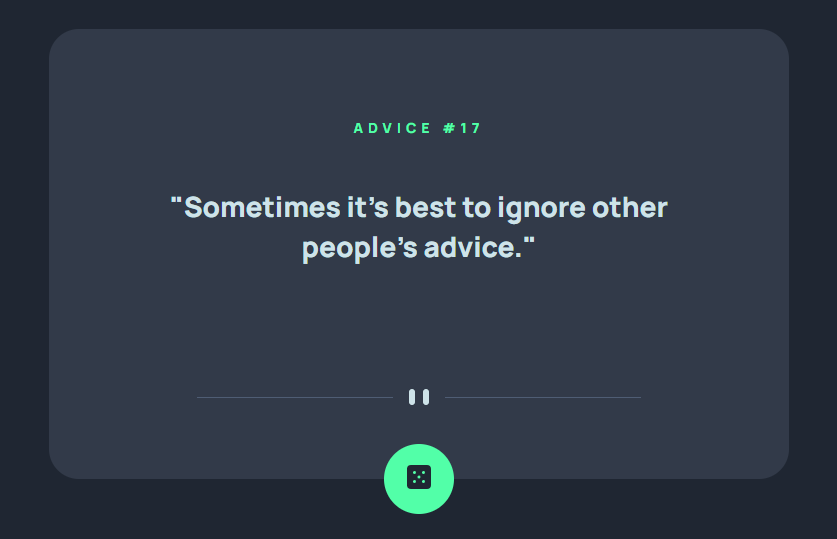
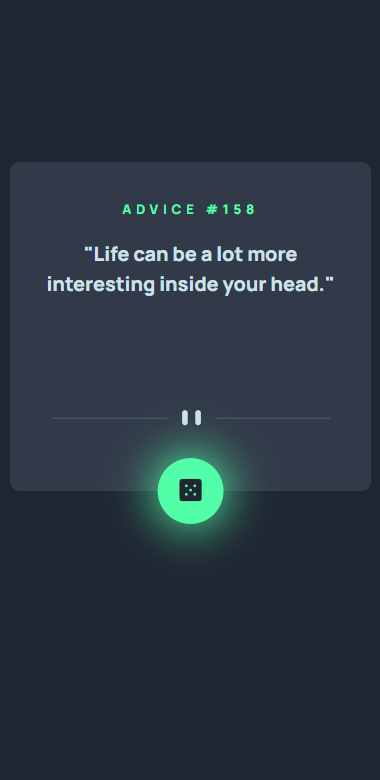

# ADVICE GENERATOR

this is a study project from [Frontend Mentor](https://www.frontendmentor.io/challenges/advice-generator-app-QdUG-13db). in this application, you have a button that, when you click, you'll receive one random piece of advice from the API.

[try it!](https://frontendmentor-advice-generator-one.vercel.app/)

## Layout

- **desktop version**

- **mobile version**

---

## Installation

clone the project

    git clone https://github.com/reginokaa/frontendmentor-advice-generator.git

then install dependences

    yarn install

run project

    yarn start

---

## Technologies

- ReactJS
- CSS
- [React Loading](https://github.com/Summer-andy/react-loading)
- Vercel

---

## Tests

:grey_exclamation: tests with Testing Library will be available soon! :construction:

---

## Author
[@reginokaa](https://www.frontendmentor.io/profile/reginokaa)
